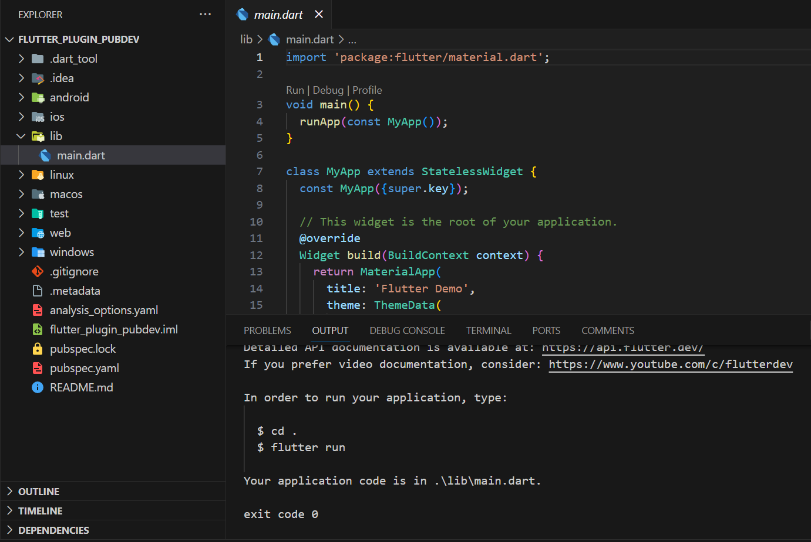
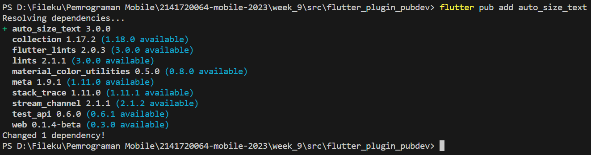
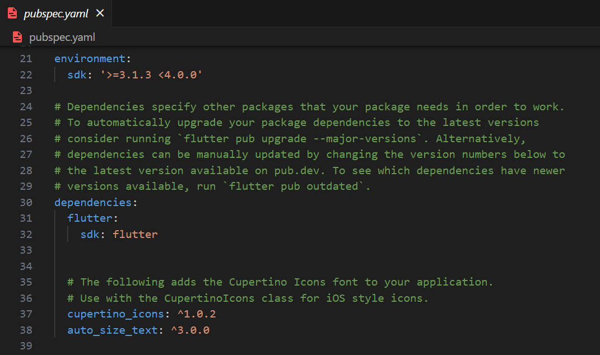
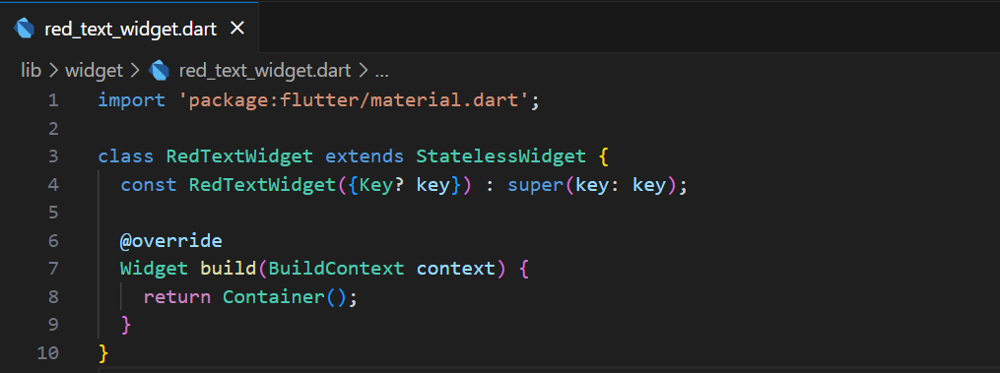
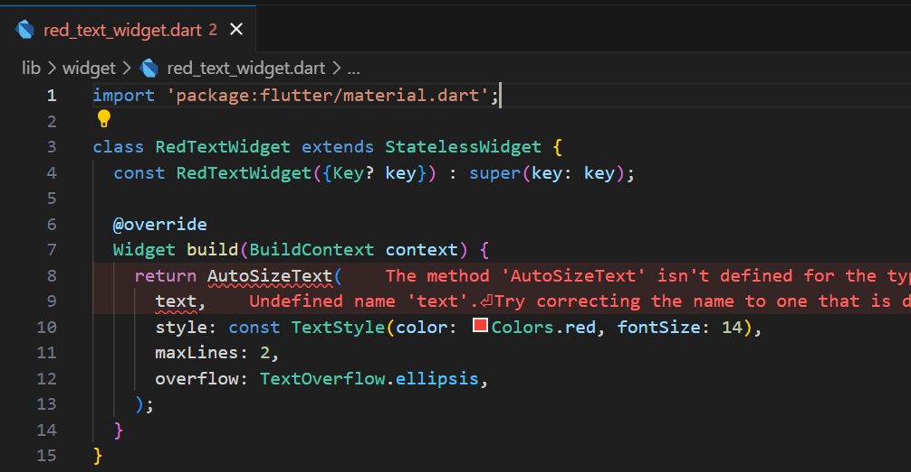
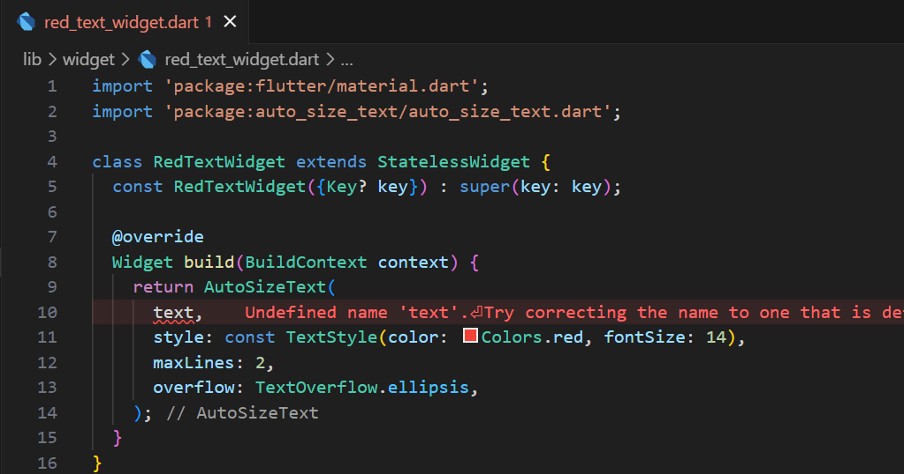
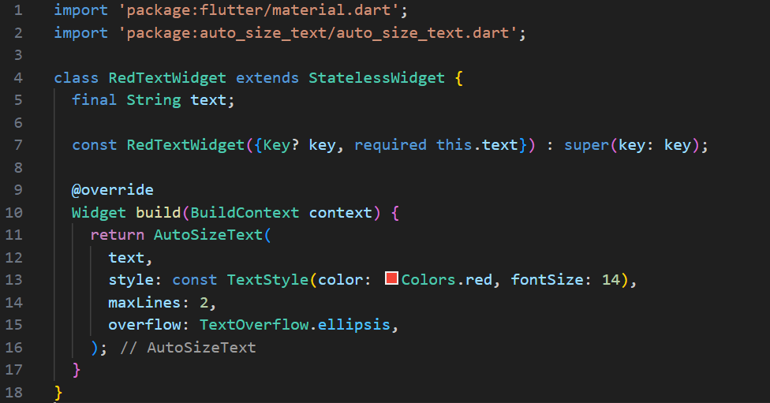
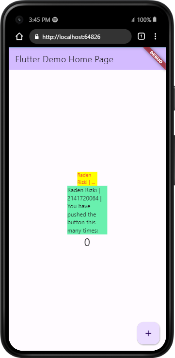

# Pemrograman Mobile - Pertemuan #9

NIM : 2141720064

Nama : Raden Rizki

#

<h3>Praktikum Menerapkan Plugin di Project Flutter</h3>

#

<h4>Langkah 1: Buat Project Baru</h4>

<h4>Langkah 2: Menambahkan Plugin</h4>

- Pada command diatas digunakan untuk menambahkan packages auto_size_text kedalam proyek flutter, dan jika berhasil maka packages akan tertera kedalam pubspec.yaml bagian dependencies

<h4>Langkah 3: Buat file red_text_widget.dart</h4>

<h4>Langkah 4: Tambah Widget AutoSizeText</h4>

- Error diatas disebabkan karena belum melakukan import kedalam file red_text_widget.dart, dan untuk variabel text belum dideklarasi atau diinisalisai untuk value ataupun variabelnya.

<h4>Langkah 5: Buat Variabel text dan parameter di constructor</h4>

- Dilangkah kelima ini selain dilakukan deklarasi variabel text, tapi juga untuk melengkapi pembuatan RedTextWidget, Widget ini akan menghasilkan font berwarna merah dengan size 14, dengan 2 maksimal baris dari text yang akan dibuat dan untuk text lanjutan yang melebihi batas (2 baris), akan diwakili dengan ellipsis atau (...).

<h4>Langkah 6: Tambahkan widget di main.dart</h4>

[Kode Program main.dart](src/flutter_plugin_pubdev/lib/main.dart)

- Pada widget pertama akan menghasilkan text dengan font berwarna merah dengan pengaturan overflow elipsis.

- Pada Widget kedua berupa widget Text yang biasanya dipakai, dengan font hitam dan menampilkan keseluruhan text.

<h3>Tugas Praktikum</h3>

<h4>Parameter Plugin auto_size_text</h4>

| Parameter | Description |
|---|---|
| key* | Digunakan mengatur bagaimana sebuat widget dapat menggantikan widget lainnya di dalam tree|
| textKey | Mengatur key untuk menghasilkan sebuat text widget |
| style* | Saat menghasilkan non-null maka style ini akan diterapkan pada text |
| minFontSize | Merupakan batasan minimum ukuran text yang digunkan untuk mengubah ukuran secara otomatis, namun akan diabaikan jika presetFontSizes diaktifkan |
| maxFontSize | Merupakan batasan maximum ukuran text yang digunkan untuk mengubah ukuran secara otomatis, namun akan diabaikan jika presetFontSizes diaktifkan |
| stepGranularity | Digunakan untuk memberikan ukuran text atau font berdasarkan batasan yang diberikan |
| presetFontSizes | Mendefinisikan terlebih dahulu segala kemungkinan ukuran font. parameter ini harus dalam keadaan descending atau menurun |
| group | Menyinkronkan beberapa ukuran text dalam AutoSizesTexts |
| textAlign | Mengatur bagaimana sebuat text disejajarkan atau diratakan secara horizontal |
| textDirection * | Menentukan bagaimana textAlign akan dihasilkan seperti pada textAlign.start dan textAlign.end |
| locale * | Digunakan untuk memilih font ketika karakter Unicode yang sama dapat dirender secara berbeda, bergantung pada lokalnya. |
| softWrap | Mengatur apakah text pada suatu baris harus terputus atau tidak |
| wrapWords | Digunakan untuk menentukan apakah kata-kata yang tidak muat dalam satu baris harus dibungkus. Default dari paramter ini adalah true untuk berperilaku seperti Teks. |
| overflow | Parameter ini digunakan untuk menangani kelebihan text yang melebihi batas yang ditentukan |
| overflowReplacement | Jika teks dalam keadaan overflow dan tidak sesuai batas yang diberikan, maka widget ini akan ditampilkan. |
| textScaleFactor * | Jumlah piksel font untuk setiap logical piksel. Parameter ini juga mempengaruhi parameter lain seperti minFontSize, maxFontSize dan presetFontSizes.|
| maxLines | Parameter ini untuk menentukan nilai maksimal optioanl untuk merentangkan teks pada setiap baris. |
| semanticsLabel * | Sebuah parameter yang digunakan untuk mengatur label semantik pada suatu teks. |

# 