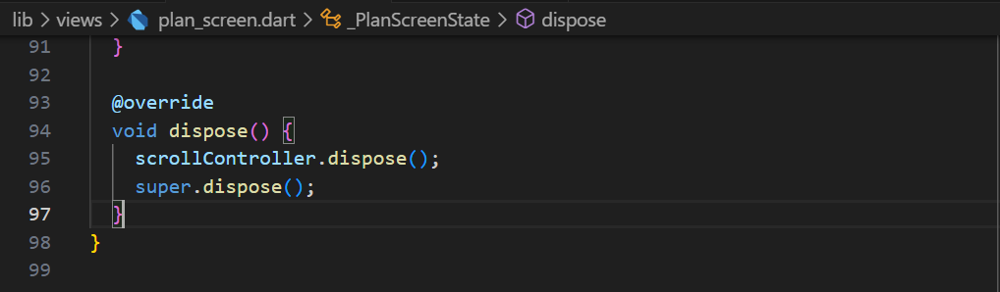

# Pemrograman Mobile - Pertemuan #11

NIM : 2141720064

Nama : Raden Rizki

#

<h3>Praktikum 1: Dasar State dengan Model-View</h3>

#

<h4>Langkah 1: Buat Project Baru</h4>

<h4>Langkah 2: Membuat model task.dart</h4>

<h4>Langkah 3: Buat file plan.dart</h4>

<h4>Langkah 4: Buat file data_layer.dart</h4>

- Kode diatas dapat membantu dalam penggunaan model yang sudah dibuat pada suatu widget. Dengan hanya mengakses atau mengimport data_layer.dart maka sudah dapat mengakses kedua model tersebut, tanpa harus melakukan import untuk masing-masing plan.dart dan task.dart.

<h4>Langkah 5: Pindah ke file main.dart</h4>

<h4>Langkah 6: buat plan_screen.dart</h4>

- Pada kode program diatas variabel plan digunakan untuk menyimpan value yang diberikan atau mengatur data apa saja yang akan disimpan ketika dilakukan penambahan list task. Variabel akan digunakan pada langkah ketuju. Penggunaan const atau constanta tersebut ditunjukan untuk memastikan seluruh variabel dari model Plan seperti tasks dan name memiliki value yang tepat saat objek digunakan, sehingga dapat meningkatkan performa compiler.

<h4>Langkah 7: buat method _buildAddTaskButton()</h4>

<h4>Langkah 8: buat widget _buildList()</h4>

<h4>Langkah 9: buat widget _buildTaskTile</h4>

[Kode Program plan_screen.dart](src/master_plan/lib/views/plan_screen.dart)

- Pada langkah ini halaman master_plan sudah bisa melakukan penambahan list dan melakukan pengisian pada masing-masing baris list, selian itu sudah bisa dilakukan check pada checkbox dan akan check dapat dihilangkan dengan mengklik ulang checkbox.

<h4>Langkah 10: Tambah Scroll Controller</h4>

<h4>Langkah 11: Tambah Scroll Listener</h4>

<h4>Langkah 12: Tambah controller dan keyboard behavior</h4>

<h4>Langkah 13: Terakhir, tambah method dispose()</h4>

- Lifecycle state pada langkah 11 dan 13 diatas yaitu initState berguna untuk inisialisasi variabel maupun objek dan menambahkan listener untuk perubahan suatu state sedangkan dispose berguna untuk membersihkan sumber daya yang digunakan oleh scrollController ketika aplikasi sudah ditutup

<h4>Langkah 14: Hasil</h4>

#

<h3>Praktikum 2: Mengelola Data Layer dengan InheritedWidget dan InheritedNotifier</h3>

#

<h4>Langkah 1: Buat file plan_provider.dart</h4>

<h4>Langkah 2: Edit main.dart</h4>

<h4>Langkah 3: Tambah method pada model plan.dart</h4>

<h4>Langkah 4: Pindah ke PlanScreen</h4>

<h4>Langkah 5: Edit method _buildAddTaskButton</h4>

<h4>Langkah 6: Edit method _buildTaskTile</h4>

<h4>Langkah 7: Edit _buildList</h4>

<h4>Langkah 8: Tetap di class PlanScreen</h4>

<h4>Langkah 9: Tambah widget SafeArea</h4>

