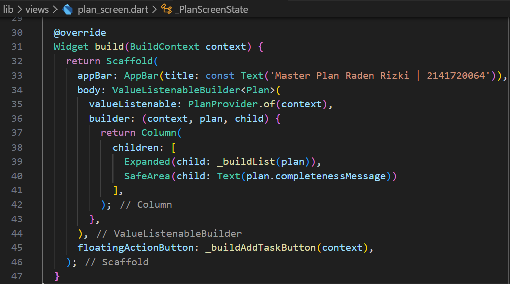
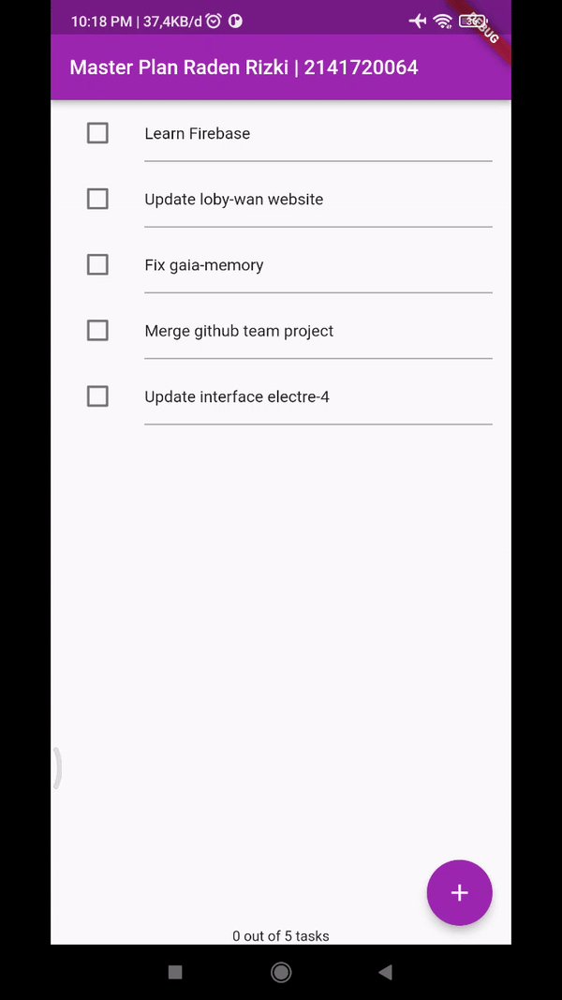

# Pemrograman Mobile - Pertemuan #11

NIM : 2141720064

Nama : Raden Rizki

#

<h3>Praktikum 1: Dasar State dengan Model-View</h3>

#

<h4>Langkah 1: Buat Project Baru</h4>

<h4>Langkah 2: Membuat model task.dart</h4>

<h4>Langkah 3: Buat file plan.dart</h4>

<h4>Langkah 4: Buat file data_layer.dart</h4>

- Kode diatas dapat membantu dalam penggunaan model yang sudah dibuat pada suatu widget. Dengan hanya mengakses atau mengimport data_layer.dart maka sudah dapat mengakses kedua model tersebut, tanpa harus melakukan import untuk masing-masing plan.dart dan task.dart.

<h4>Langkah 5: Pindah ke file main.dart</h4>

<h4>Langkah 6: buat plan_screen.dart</h4>

- Pada kode program diatas variabel plan digunakan untuk menyimpan value yang diberikan atau mengatur data apa saja yang akan disimpan ketika dilakukan penambahan list task. Variabel akan digunakan pada langkah ketuju. Penggunaan const atau constanta tersebut ditunjukan untuk memastikan seluruh variabel dari model Plan seperti tasks dan name memiliki value yang tepat saat objek digunakan, sehingga dapat meningkatkan performa compiler.

<h4>Langkah 7: buat method _buildAddTaskButton()</h4>

<h4>Langkah 8: buat widget _buildList()</h4>

<h4>Langkah 9: buat widget _buildTaskTile</h4>

[Kode Program plan_screen.dart](src/master_plan/lib/views/plan_screen.dart)

- Pada langkah ini halaman master_plan sudah bisa melakukan penambahan list dan melakukan pengisian pada masing-masing baris list, selian itu sudah bisa dilakukan check pada checkbox dan akan check dapat dihilangkan dengan mengklik ulang checkbox.

<h4>Langkah 10: Tambah Scroll Controller</h4>

<h4>Langkah 11: Tambah Scroll Listener</h4>

<h4>Langkah 12: Tambah controller dan keyboard behavior</h4>

<h4>Langkah 13: Terakhir, tambah method dispose()</h4>

- Lifecycle state pada langkah 11 dan 13 diatas yaitu initState berguna untuk inisialisasi variabel maupun objek dan menambahkan listener untuk perubahan suatu state sedangkan dispose berguna untuk membersihkan sumber daya yang digunakan oleh scrollController ketika aplikasi sudah ditutup

<h4>Langkah 14: Hasil</h4>

#

<h3>Praktikum 2: Mengelola Data Layer dengan InheritedWidget dan InheritedNotifier</h3>

#

<h4>Langkah 1: Buat file plan_provider.dart</h4>

- Pada langkah pertama inheritedWidget terletak pada extends InheritedNotifier<ValueNotifier<Plan>>, InheritedNotifier berguna dalam membagikan value variabel kesetiap widget yang terkait, dan dapat melakukan perubahan keseluruh widget terkait saat value variabel tersebut diubah pada suatu widget, sehingga value terjadi secara menyeluruh tidak hanya pada satu widget saja, seperti halnya penggunaan variabel global.

<h4>Langkah 2: Edit main.dart</h4>

<h4>Langkah 3: Tambah method pada model plan.dart</h4>

- Pada kode diatas akan dilakukan pengambilan data tasks yang memiliki kondisi status variabel complete pada task, jika statusnya true maka akan dihitung dalam tasks, kemudian data tasks akan diambil panjang atau jumlah data yang memenuhi kondisi. Pada variabel selanjutnya akan memiliki pesan mengenai jumlah tasks yang sudah diselesaikan. Dengan kedua variabel tersebut akan memudahkan dalam melihat status rencana atau tasks yang sudah diselesaikan atau checked.

<h4>Langkah 4: Pindah ke PlanScreen</h4>

<h4>Langkah 5: Edit method _buildAddTaskButton</h4>

<h4>Langkah 6: Edit method _buildTaskTile</h4>

<h4>Langkah 7: Edit _buildList</h4>

<h4>Langkah 8: Tetap di class PlanScreen</h4>

<h4>Langkah 9: Tambah widget SafeArea</h4>

- Aplikasi master_plan sudah dapat menampilkan status berapa tasks yang sudah diselesaikan atau checked dari keseluruhan tasks yang sudah dibuat atau ditambakan.

#

<h3>Praktikum 3: Membuat State di Multiple Screens</h3>

#

<h4>Langkah 1: Edit PlanProvider</h4>

<h4>Langkah 2: Edit main.dart</h4>

<h4>Langkah 3: Edit plan_screen.dart</h4>

<h4>Langkah 4: Error</h4>

<h4>Langkah 5: Tambah getter Plan</h4>

<h4>Langkah 6: Method initState()</h4>

<h4>Langkah 7: Widget build</h4>

[Kode Program Langkah 7](/week_11/src/master_plan/lib/views/plan_screen.dart)

<h4>Langkah 8: Edit _buildTaskTile</h4>

[Kode Program Langkah 8](/week_11/src/master_plan/lib/views/plan_screen.dart)

- Error index out of range dapat diselesaikan dengan merubah inisialisasi variabel Plan currentPlan = plan; pada widget _buildAddTaskButton dan _buildTaskTile dengan posisi setelah planIndex dengan inisialisasi Plan currentPlan = planNotifier.value[planIndex];

<h4>Langkah 9: Buat screen baru</h4>

<h4>Langkah 10: Pindah ke class _PlanCreatorScreenState</h4>

<h4>Langkah 11: Pindah ke method build</h4>

<h4>Langkah 12: Buat widget _buildListCreator</h4>

<h4>Langkah 13: Buat void addPlan()</h4>

<h4>Langkah 14: Buat widget _buildMasterPlans()</h4>

- Pada aplikasi tahap ini sudah dapat membuat list plan dengan setiap plannya dapat menambahkan tasks seperti yang dilakukan pada dua praktikum sebelumnya. Pada praktikum ini juga saat melakukan check pada PlanScreen maka status dan informasi dalam PlanCreatorScreen juga akan diperbaharui contohnya status checked atau tasks apa saja yang sudah diselesaikan pada PlanScreen juga akan ditampilkan dengan data yang sama di PlanCreatorScreen dengan value yang dapat berbeda di list plan halaman PlanCreatorScreen.

<h4>Penjelasan Praktikum 3</h4>

- Hal pertama yang akah dilakukan aplikasi adalah dengan mengembalikan objek PlanProvider yang mana juga akan menampilkan PlanCreatorScreen, pada halaman ini dapat menambahkan plan dengan menginputkan judul atau text plan kemudian dengan enter maka akan menambahkan plan kedalam list. Selanjunya dengan klik salah satu plan dalam list maka akan dinavigasi ke halaman PlanScreen, halaman ini merupakan halaman yang sudah dibuat pada praktikum satu sampai dua. Pada halaman ini dapat menambahkan list task baru, yang selanjutnya task ini dapat diberi deskripsi berupa teks dan dapat dilakukan check untuk menyatakan tugas sudah diselesaikan, status tasks yang sudah terselesaikan akan diperbarui baik di PlanScreen maupun pada halaman PlanCreatorScreen.