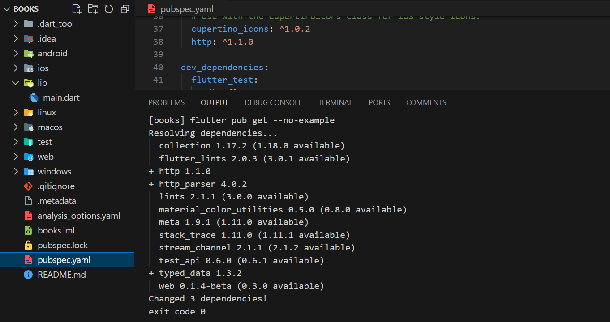
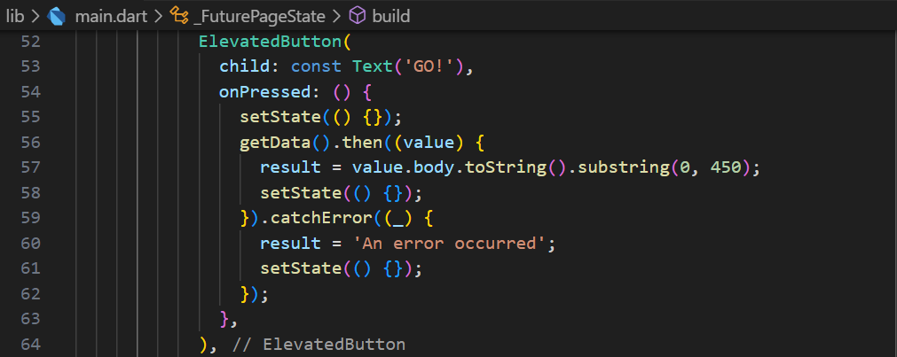

# Pemrograman Mobile - Pertemuan #12

NIM : 2141720064

Nama : Raden Rizki

#

<h3>Praktikum 1: Mengunduh Data dari Web Service (API)</h3>

#

<h4>Langkah 1: Buat Project Baru</h4>

<h4>Langkah 2: Cek file pubspec.yaml</h4>

<h4>Langkah 3: Buka file main.dart</h4>

[Kode Program main.dart](/week_12/src/books/lib/main.dart)

<h4>Langkah 4: Tambah method getData()</h4>

<h4>Langkah 5: Tambah kode di ElevatedButton</h4>

- Setelah data JSON dari API diberikan ke client, data tersebut dirubah terlebih dahulu dirubah ke tipe data String dengan menggunakan method toString(), sedangkan method substring(0, 450) untuk mengambil karakter dari indeks 0 sampai 450. Kemudian catchError() berguna untuk menangani error yang terjadi saat proses asynchronous, dalam kode ini menghasilkan result berupa 'An error occurred'.