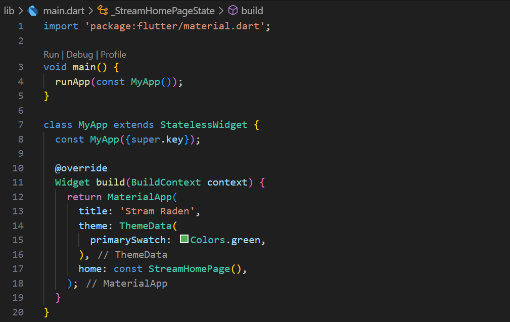

# Pemrograman Mobile - Pertemuan #13

NIM : 2141720064

Nama : Raden Rizki

#

<h3>Praktikum 1: Dart Streams</h3>

#

<h4>Langkah 1: Buat Project Baru</h4>

<h4>Langkah 2: Buka file main.dart</h4>

<h4>Langkah 3: Buat file baru stream.dart</h4>

<h4>Langkah 4: Tambah variabel colors</h4>

<h4>Langkah 5: Tambah method getColors()</h4>

<h4>Langkah 6: Tambah perintah yield*</h4>

- Kode yield* berfungsi untuk mengembalikan banyak value yang dimethod ini dihasilkan oleh streams.

- Pada method getColors() ini Stream disetiap 1 detik akan mengembalikan value dari setiap indeks list colors, indeks ini dihasilkan dari t sebagai waktu (detik) modulus dari panjang list colors.