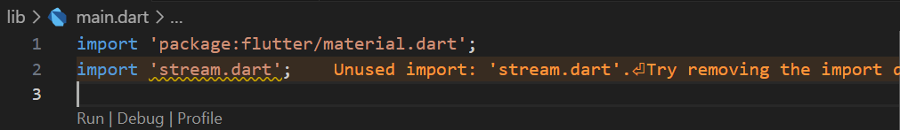

# Pemrograman Mobile - Pertemuan #13

NIM : 2141720064

Nama : Raden Rizki

#

<h3>Praktikum 1: Dart Streams</h3>

#

<h4>Langkah 1: Buat Project Baru</h4>

<h4>Langkah 2: Buka file main.dart</h4>

<h4>Langkah 3: Buat file baru stream.dart</h4>

<h4>Langkah 4: Tambah variabel colors</h4>

<h4>Langkah 5: Tambah method getColors()</h4>

<h4>Langkah 6: Tambah perintah yield*</h4>

- Kode yield* berfungsi untuk mengembalikan banyak value yang dimethod ini dihasilkan oleh streams.

- Pada method getColors() ini Stream disetiap 1 detik akan mengembalikan value dari setiap indeks list colors, indeks ini dihasilkan dari t sebagai waktu (detik) modulus dari panjang list colors. Sehingga disetiap detiknya value colors yang dikembalikan dapat berbeda-beda.

<h4>Langkah 7: Buka main.dart</h4>

<h4>Langkah 8: Tambah variabel</h4>

<h4>Langkah 9: Tambah method changeColor()</h4>

<h4>Langkah 10: Lakukan override initState()</h4>

<h4>Langkah 11: Ubah isi Scaffold()</h4>

<h4>Langkah 12: Run</h4>

<h4>Langkah 13: Ganti isi method changeColor()</h4>

- Perbedaan menggunakan listen dan await for adalah pada await for akan dilakukan perulangan dengan value yang didapat dari memanggil method getColors(), setiap value tersebut akan disimpan dalam variabel eventColor disetiap perulangannya, namun blok kode dalam for seperti setState akan dijalankan setelah proses pemanggilan method getColors() selesai dilakukan dan sudah mengembalikan nilai set yang setiap valuenya akan disimpan dalam eventColor. Sedankan listen() setiap event atau value yang sudah diterima dapat langsung digunakan dan setState dapat dijalankan tanpa perlu menunggu seluruh Stream selesai.
