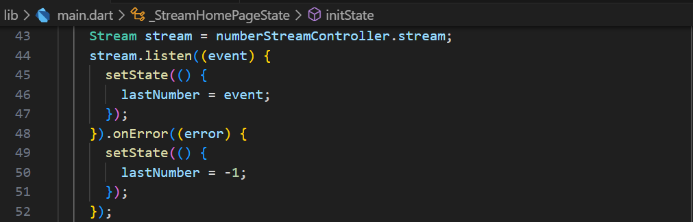

# Pemrograman Mobile - Pertemuan #13

NIM : 2141720064

Nama : Raden Rizki

#

<h3>Praktikum 1: Dart Streams</h3>

#

<h4>Langkah 1: Buat Project Baru</h4>

<h4>Langkah 2: Buka file main.dart</h4>

<h4>Langkah 3: Buat file baru stream.dart</h4>

<h4>Langkah 4: Tambah variabel colors</h4>

<h4>Langkah 5: Tambah method getColors()</h4>

<h4>Langkah 6: Tambah perintah yield*</h4>

- Kode yield* berfungsi untuk mengembalikan banyak value yang dimethod ini dihasilkan oleh streams.

- Pada method getColors() ini Stream disetiap 1 detik akan mengembalikan value dari setiap indeks list colors, indeks ini dihasilkan dari t sebagai waktu (detik) modulus dari panjang list colors. Sehingga disetiap detiknya value colors yang dikembalikan dapat berbeda-beda.

<h4>Langkah 7: Buka main.dart</h4>

<h4>Langkah 8: Tambah variabel</h4>

<h4>Langkah 9: Tambah method changeColor()</h4>

<h4>Langkah 10: Lakukan override initState()</h4>

<h4>Langkah 11: Ubah isi Scaffold()</h4>

<h4>Langkah 12: Run</h4>

<h4>Langkah 13: Ganti isi method changeColor()</h4>

- Perbedaan menggunakan listen dan await for adalah pada await for akan dilakukan perulangan dengan value yang didapat dari memanggil method getColors(), setiap value tersebut akan disimpan dalam variabel eventColor disetiap perulangannya, namun blok kode dalam for seperti setState akan dijalankan setelah proses pemanggilan method getColors() selesai dilakukan dan sudah mengembalikan nilai set yang setiap valuenya akan disimpan dalam eventColor. Sedankan listen() setiap event atau value yang sudah diterima dapat langsung digunakan dan setState dapat dijalankan tanpa perlu menunggu seluruh Stream selesai.

#

<h3>Praktikum 2: Stream controllers dan sinks</h3>

#

<h4>Langkah 1: Buka file stream.dart</h4>

<h4>Langkah 2: Tambah class NumberStream</h4>

<h4>Langkah 3: Tambah StreamController</h4>

<h4>Langkah 4: Tambah method addNumberToSink</h4>

<h4>Langkah 5: Tambah method close()</h4>

<h4>Langkah 6: Buka main.dart</h4>

<h4>Langkah 7: Tambah variabel</h4>

<h4>Langkah 8: Edit initState()</h4>

- Pada langkah kedelapan dibuat terlebih dahulu objek NumberStream yang berasal dari stream.dart, kemudian mengakses variabel controller dari numberStream dengan menyimpannya ke variabel numberStreamController, data stream dari numberStreamController ini akan disimpan dalam variabel stream bertipe data Stream, yang akhirnya value stream yang diperoleh ini akan digunakan untuk memperbarui value dari lastNumber.

<h4>Langkah 9: Edit dispose()</h4>

<h4>Langkah 10: Tambah method addRandomNumber()</h4>

- Method addRandomNumber() pertama-tama membuat objek Random() dengan nama random, yang kemudian objek ini akan digunakan untuk memperoleh value integer acak dengan rentang 0 sampai dengan 9 dan disimpan dalam variabel myNum. Selanjutnya memanggil method addNumbertoSink() dari objek numberStram yang dibuat dilangkah kedelapan sebelumnya. Dengann mengakses addNumbertoSink() dengan argument value dari myNum, maka value ini akan ditambahkan kedalam aliran data yang dibuat.

<h4>Langkah 11: Edit method build()</h4>

<h4>Langkah 12: Run</h4>

<h4>Langkah 13: Buka stream.dart</h4>

- Method addError() diatas digunakan untuk menambahkan error kedalam aliran data dengan pesan 'error'.

<h4>Langkah 14: Buka main.dart</h4>

- Pada langkah ke-14 dilakukan penanganan error saat stream.listen, yaitu jika terjadi error, maka value dari variabel last number akan diset menjadi -1.

<h4>Langkah 15: Edit method addRandomNumber()</h4>

- Method yang dibuat di langkah ke-13 sebelumnya dipanggil dilangakah ini, yaitu metdhod addError() dengan menggunakan objek numberStream.

#

<h3>Praktikum 3: Injeksi data ke streams</h3>

#

<h4>Langkah 1: Buka main.dart</h4>

- Langkah pertama ini membuat objek StreamTransformer dengan nama transformer. Objek ini nantinya akan digunakan untuk memanipulasi atau memfilter data pada Streams.

<h4>Langkah 2: Tambahkan kode ini di initState</h4>

- Pada kode di atas dibuat untuk menangani aliran data dengan membuat objek StreamTransformer yang menerima data integer dan menghasilkan integer juga. Pada parameter pertama ini jika aliran data tidak menghasilkan error, maka value dari aliran data tersebut akan diperbarui dengan mengalikan value dengan 10 dan ditambahkan kembali ke aliran data. Kemudian parameter kedua akan menangani  error maka value aliran akan diperbarui menjadi -1. Dan setelah selesai, filter ini akan ditutup.

<h4>Langkah 3: Tetap di initState</h4>

- Objek transformer yang dibuat sebelumnya digunakan disini, pada blok kode program diatas, akan dilakukan perubahan data berdasarkan parameter yang dibuat sebelumnya. Jika berjalan tanpa error maka value yang ditambahkan oleh transformer sebelumnya akan digunakan untuk memperbarui value lastNumber, sedangkan jika terdapat error maka value lastNumber akan diset dengan nilai -1.

<h4>Langkah 4: Run</h4>

#

<h3>Praktikum 4: Subscribe ke stream events</h3>

#

<h4>Langkah 1: Tambah variabel</h4>

<h4>Langkah 2: Edit initState()</h4>

- Kode program langkah kedua ini memperbarui kode sebelumnya untuk pembuatan objek stream kemudian menyimpan proses listen stream kedalam variabel subscription, yang seperti praktikum sebelumnya, listen stream pada blok kode ini digunakan untuk memperbarui value dari variabel dengan event yang didapat.

<h4>Langkah 3: Tetap di initState()</h4>

<h4>Langkah 4: Tambah properti onDone()</h4>

<h4>Langkah 5: Tambah method baru</h4>

<h4>Langkah 6: Pindah ke method dispose()</h4>

- Kode subscription.cancel() diatas berfungsi untuk membatalkan proses listener yang sudah disimpan atau diwakili dalam subscription. Sehingga nilai baru akan berhenti untuk diberikan ke stream.

<h4>Langkah 7: Pindah ke method build()</h4>

<h4>Langkah 8: Edit method addRandomNumber()</h4>

- Langkah kedelapan ini dilakukan penambahan kondisi pada method addNumbers(), yaitu jika status numberStreamController tidak closed maka value myNum akan ditambahkan ke sink, namun jika status numberStreamController dalam status closed maka value lastNumber akan diset dengan -1.

<h4>Langkah 9: Run</h4>

<h4>Langkah 10: Tekan button 'Stop Subscription'</h4>

