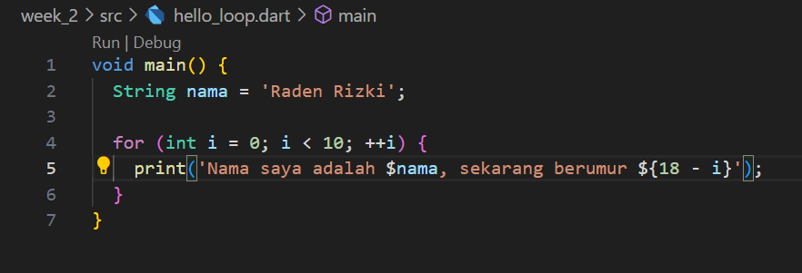
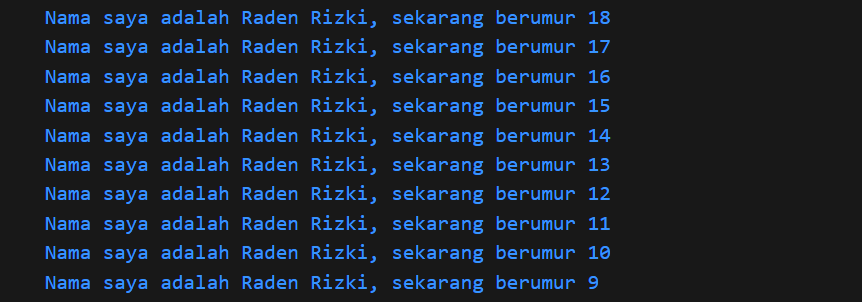

# Pemrograman Mobile - Pertemuan #2

<h2>Tugas Pertemuan 2</h2>

NIM : 2141720064

Nama : Raden Rizki

<h3>Praktikum</h3>

# 

- Soal 1

a. Kode Program

b. Output

# 

- Soal 2

<h4>Mengapa sangat penting untuk memahami bahasa pemrograman Dart sebelum kita menggunakan framework Flutter ? Jelaskan!</h4>

<h3>Jawab :<h3>

<h4>Karena bahasa pemrograman Dart yang akan digunakan dalam pembuatan atau pengembangan aplikasi dalam framework Flutter ini, sehingga saat kita memahami bahasa pemrograman Dart, maka kita juga dapat menggunakan Flutter secara optimal dengan pemanfaatan segala fitur-fitur yang ada dalam Dart, hal ini juga dapat meningkatkan variasi dan kompleksitas pada aplikasi dart yang dikembangkan.</h4>

# 

- Soal 3

<h2>Pengantar Bahasa Pemrograman Dart</h2>

<h3>A. Fitur Dart</h3>

Bahasa Pemrograman Dart merupakan salah satu bahasa pemrograman tingkat tinggi berbasi OOP (Object Orriented Programming) yang memiliki beberapa fitur sebagai berikut

<ol>
    <li>Productive Tooling</li>
    <li>Garbage Collection</li>
    <li>Type Annotations</li>
    <li>Statically Typed</li>
    <li>Portability</li>
</ol>

<h3>B. Cara Kerja Dart</h3>

Dart dapat dieksekusi dengan menggunakan dua cara yaitu dengan Dart Virtual Machines (VMs) dan JavaScript Compilations.

Lingkungan yang mendukung Dart perlu memperhatikan fitur-fitur penting berikut : 

<ol>
    <li>Runtime Systems</li>
    <li>Dart Core Libraries</li>
    <li>Garbage Collectors</li>
</ol>

Pada eksekusi kode Dart dapat beroprasi dalam dua mode kompilasi yaitu <strong>Just-In-Time (JIT)</strong> dan <strong>Ahead-Of-Time (AOT)</strong>

<ol>
    <li><strong>Just-In-Time (JIT)</strong> melakukan kompilasi sesuai kebutuhan dengan memanfaatkan fitur seperti <strong>debungging</strong> dan <strong>hot reload</strong></li>
    <li><strong>Ahead-Of-Time (AOT)</strong> memiliki performa yang sangat besar daripada JIT, namun tidak memiliki fitur seperti <strong>debungging</strong> dan <strong>hot reload</strong></li>
</ol>

<h3>C. Struktur Bahasa Dart</h3>

- Operator Aritmatika

<ol>
    <li>Penjumlahan ( + )</li>
    <li>Pengurangan ( - )</li>
    <li>Perkalian ( * )</li>
    <li>Pembagian ( / )</li>
    <li>Pembagian Bilangan Bulat ( ~/ )</li>
    <li>Modulus ( % )</li>
    <li>Negasi ( -expression )</li>
</ol>

- Operator Increment dan Decrement

<ol>
    <li>++var atau var++ ( Increment )</li>
    <li>--var atau var-- ( Decrement )</li>
</ol>

- Operator Persaman ( == dan != )

- Operator Relasioanl ( <, >, >=, <= )

- Operator Logika

<ol>
    <li>Negasi ( !expression )</li>
    <li>OR ( || )</li>
    <li>AND ( && )</li>
</ol>

# 

- Soal 4

Link Google Slide : <em>https://docs.google.com/presentation/d/1HtkTox1kaHz59Zd-_tpRsob_ZZKy780VDkGcxA-X2d0/edit#slide=id.p</em>