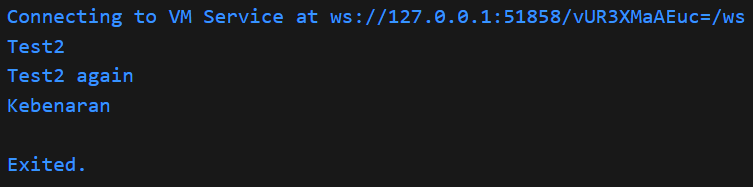

# Pemrograman Mobile - Pertemuan #3

NIM : 2141720064

Nama : Raden Rizki

#

<h3>Praktikum 1 ( if / else )</h3>

#

<h4>Langkah 1</h4>

<h4>Langkah 2</h4>

- Pada kode program sebelumnya terdapat error pada sintaks program yaitu else If dan Else, maka diubah menjadi else if dan else.
- Kemudian hasil running menampilkan "Test2" dan "Test2 again", hal ini terjadi karena nilai dari String test memenuhi kondisi 'test == "test2"', sehingga baris program yang terdapat dalam kondisi ini dijalankan.

<h4>Langkah 3</h4>

#

<h3>Praktikum 2 ( while dan do while )</h3>

#

<h4>Langkah 1</h4>

<h4>Langkah 2</h4>

- Untuk error dapat ditangani dengan melakukan deklarasi dan inisialisasi pada varibel counter dengan tipe data integer dan saya memilih nilai awal 0.

- Selanjutnya saya import 'dart:io' dan menggunakan stdout.write agar print tanpa new line, maka angka 0 sampai 32 akan ditampilkan.

<h4>Langkah 3</h4>

#

<h3>Praktikum 3 ( for dan break continue )</h3>

#

<h4>Langkah 1</h4>

<h4>Langkah 2</h4>

- Terdapat error pada variabel index, dengan tidak melakukan deklarasi terlebih dahulu dan tidak adanya proses increament sehingga program tidak berhenti berjalan, sehingga dilakukan penambahan tipe data int untuk deklarasi index dan increament dengan index++.

- Program menghasilkan output dengan menampilkan angka 10 sampai 26

<h4>Langkah 3</h4>

