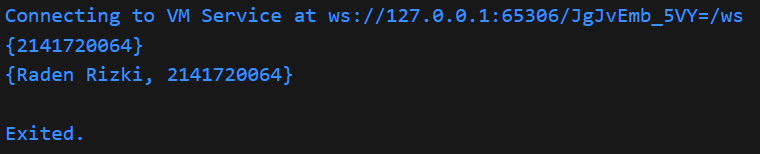
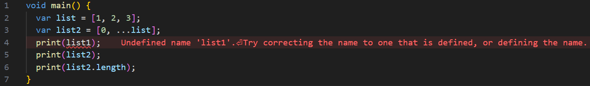

# Pemrograman Mobile - Pertemuan #4

NIM : 2141720064

Nama : Raden Rizki

#

<h3>Praktikum 1: Eksperimen Tipe Data List</h3>

#

<h4>Langkah 1</h4>

<h4>Langkah 2</h4>

- Kode program berjalan dengan lancar tanpa error, karena setiap baris assert menghasilkan true, karena sudah sesuai dengan list, sesuai data yang diprint maka akan menghasilkan 3 2 1

<h4>Langkah 3</h4>

<h5>Kode Program</h5>

<h5>Output Program</h5>

- Dengan melakukan print langsung pada nama variabel tanpa mengikutsertakan index, output akan menampilkan keseluruhan data pada list mahasiswa

#

<h3>Praktikum 2: Eksperimen Tipe Data Set</h3>

#

<h4>Langkah 1</h4>

<h4>Langkah 2</h4>

- Saat data set ditampilkan maka seperti halnya pada list, seluruh data dalam set akan ditampilkan dengan keadaan yang terurut sesuai index, jika pada list kita menggunakan kurung siku [] untuk mengakses index, sedangkat pada set kita dapat menggunakan method elementAt(), seperti berikut print(halogens.elementAt(0));

<h4>Langkah 3</h4>

<h5>Kode Program</h5>

<h5>Output Program</h5>

- Kode program diatas dapat berjalan dengan baik tanpa error, dengan hasil menampilkan kurung kurawa ({}).

<h5>Kode Program</h5>

<h5>Output Program</h5>

- Method add() dapat menambahkan data kedalam set, sedangkan addAll() dapat digunkan untuk memasukkan nilai dari variabel set lain atau dapat untuk digunakan menggabungkan variabel set.

#

<h3>Praktikum 3: Eksperimen Tipe Data Maps</h3>

#

<h4>Langkah 1</h4>

<h4>Langkah 2</h4>

- Saat variabel list ditampilkan, maka akan menyertakan setiap key dan juga value yang dimiliki variabel maps tersebut, variabel dapat berupa String, int, class, maupun objek lain.

<h4>Langkah 3</h4>

<h5>Kode Program</h5>

- Jika suatu maps memiliki nilai awal yang keseluruhan datanya sudah menggunakan key berupa tipe data tertentu, seperti int ataupun sudah ditentukan dengan key berupa int, maka saat ingin menambahkan data baru maka harus menggunkan key dengan tipe data yang sama seperti berikut, dan juga jika key sudah ada, maka nilai bukan ditambahkan melainkan diperbarui pada key tersebut.

<h5>Output Program</h5>

#

<h3>Praktikum 4: Eksperimen Tipe Data List: Spread dan Control-flow Operators</h3>

#

<h4>Langkah 1</h4>

<h4>Langkah 2</h4>

- Terjadi error karena variabel yang dituju tidak terdefinisi, sehingga dapat diperbaiki dengan varibel yang sudah dideklarasi dan diinisialisasi. Pada kode diatas (...) dapat digunakan untuk menggabungkan nilai pada list dengan nilai pada variabel list lain.

<h4>Langkah 3</h4>

<h5>Kode Program</h5>

- Pada error diatas, permasalahannya sama seperti sebelumnya, yaitu varibel yang digunakan belum terdefinisi

- Untuk error tersebut dapat diperbaiki dengan merubah ...? menjadi ...

<h5>Output Program</h5>

<h5>Kode Program</h5>

<h5>Output Program</h5>

<h4>Langkah 4</h4>

<h5>Kode Program</h5>

- Error terjadi dikarenakan variabel promoActive belum dilakukan deklarasi maupun inisialisasi

- Pada program diatas jika promoActive bernilai true maka 'Outlet' akan termasuk kedalam list nav, sedangkan jika promoActive bernilai false, maka 'Outlet' tidak akan termasuk kedalam list nav.

<h4>Langkah 5</h4>

<h5>Kode Program</h5>

- Error terjadi dikarenakan variabel promoActive belum dilakukan deklarasi maupun inisialisasi

- Jika sebelumnya if hanya dapat berupa boolean, sedangkan if case, dapat menggunakan berbagai kondisi

<h4>Langkah 6</h4>

<h5>Kode Program</h5>

- Collection for dapat membantu dalam pembuatan data pada list yang memiliki pola yang sama atau berulang, sehingga dengan menggunakan Collection For ini, dapat menyingkat baris program yang digunakan.

#

<h3>Praktikum 5: Eksperimen Tipe Data Records</h3>

#

<h4>Langkah 1</h4>

<h4>Langkah 2</h4>

- Error terjadi dikarenakan kurangnya simbol semicolon (;)

- Kode program menampilkan records yang memiliki isi berupa string dan maps atau kombinai antara list dengan maps

<h4>Langkah 3</h4>

- Kode Program dapat berjalan dengan baik, dengan fungsi yang mereturn data yang sudah diswap atau tukar, yang sebelumnya (64, 32) menjadi (32, 64)

<h4>Langkah 4</h4>

- Error terjadi dikarenakan variabel yang digunakan belum memiliki value

<h4>Langkah 5</h4>

- Dari kode diatas, dalam mengakses suatu value dalam records, jika yang diakses berupa data non maps, maka dapat menggunakan index nya, yang dimulai dari 1, sedangkan jika value berupa maps, maka untuk memperoleh valuenya maka perlu menggunakan key yang dimiliki maps tersebut.

#

<h3>Tugas Praktikum</h3>

#

<h4>1. Jelaskan yang dimaksud Functions dalam bahasa Dart!</h4>

- Functions adalah kumpulan baris kode program yang memiliki tugas atau tujuan tertentu yang dapat digunakan atau dipanggil dengan menggunakan nama function dan parameter jika ada, contohnya untuk function operasi aritmatika, atau contohnya functions main() yang akan dibaca pertama kali saat program dart dijalankan.

<h4>2. Jelaskan jenis-jenis parameter di Functions beserta contoh sintaksnya!</h4>

- Named Parameters: Parameter ini digunakan dengan menyebutkan nama variabel parameter saat memanggil fungsi, hal ini dapat dilakukan dengan menambahkan kurung kurawa pada parameter ({}).

- Positional Parameters: Parameter ini digunakan dengan menginputkan parameter sesuai susunannya di parameter function yang dipanggil.

- Default Parameter: Parameter ini memiliki nilai default atau nilai awal pada function, jikalau variabel tersebut ternyata tidak diisi, sehingga variabel yang diberi default value dapat tidak diisi.

<h4>3. Jelaskan maksud Functions sebagai first-class objects beserta contoh sintaknya!</h4>

- Functions sebagai first-class objects ialah menggunakan functions lain untuk menjadi parameter pada functions tertentu.

<h4>4. Apa itu Anonymous Functions? Jelaskan dan berikan contohnya!</h4>

- Anonymous Functions, juga dikenal sebagai lambda atau closures, adalah fungsi yang tidak memiliki nama. Mereka digunakan untuk mendefinisikan blok kode yang dapat dieksekusi atau disimpan dalam variabel tanpa perlu memberikan nama.

<h4>5. Jelaskan perbedaan Lexical scope dan Lexical closures! Berikan contohnya!</h4>

- Lexical scope mengacu pada aturan yang menentukan akses ke variabel dan fungsi dalam sebuah blok kode (Penggunaan kurung kurawa) berdasarkan struktur kode secara fisik (lexical). Sedangkan Lexical closures mengacu pada kemampuan sebuah fungsi untuk menyimpan referensi ke variabel-variabel dari lingkup (scope) yang lebih tinggi, bahkan setelah fungsi tersebut telah selesai dieksekusi.

- Contoh Lexical Scope

Dari kode program diatas menunjukan, suatu variabel atau fungsi dapat diakses jika berada pada level blok kode program yang sama.

- Contoh Lexical Closure

Dari kode program diatas, disini saya menggunakan contoh yang sama untuk first class, meskipun function berada di luar functions main, namun functions tersebut masih dapat diakses dalam functions main.

<h4>6. Jelaskan dengan contoh cara membuat return multiple value di Functions!</h4>

- Dengan menggunakan records ataupun list memungkinkan functions untuk memberikan return berupa beberapa nilai yang digabungkan menjadi satu.

- a. Untuk pembuatannya dapat dimulai dengan menentukan return value dari functions berupa maps atau list

- b. Kemudian buat parameter (opsional)

- c. Selanjutnya buat suatu operasi kemudian return data sesuai yang ditentukan pada return value functions

- d. Pada main juga diperlukan variabel dengan jumlah yang sama untuk menerima return valu dari functions yang dipanggil.

#