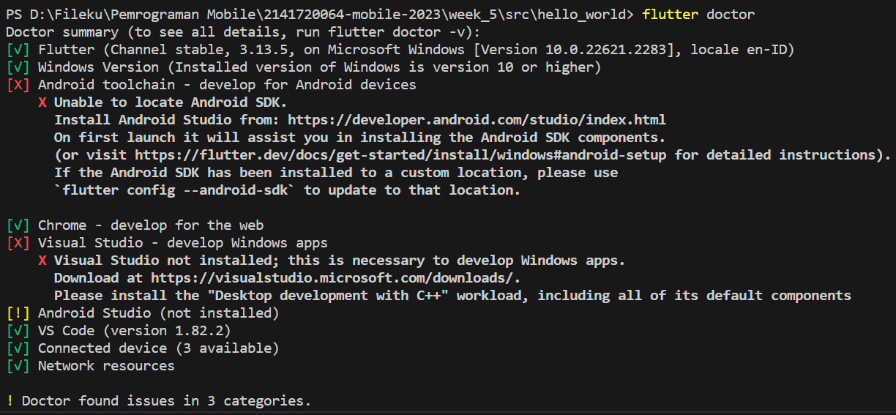
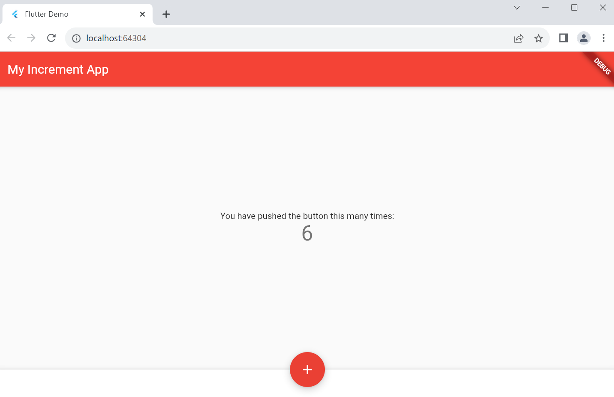
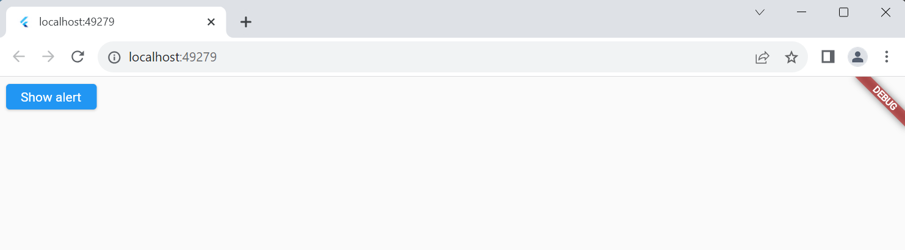
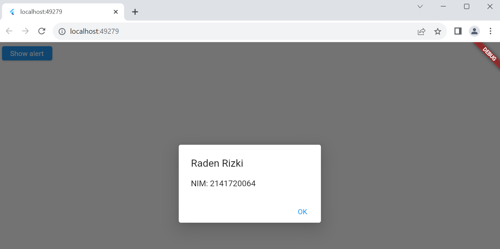
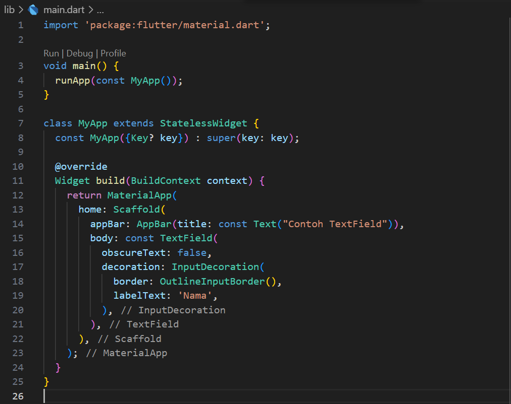
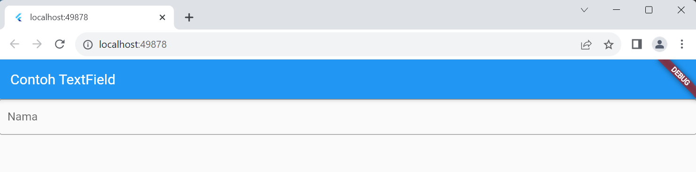
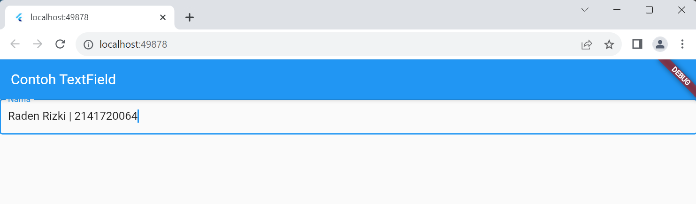
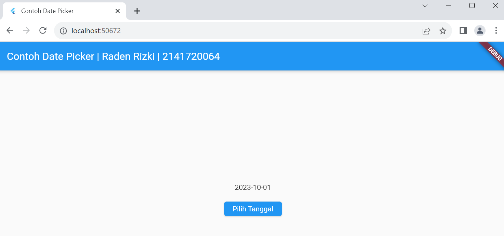

# Pemrograman Mobile - Pertemuan #5

NIM : 2141720064

Nama : Raden Rizki

#

<h3>Praktikum 1: Praktikum 1: Membuat Project Flutter Baru</h3>

#

<h4>Langkah 1: Buat Project Aplikasi Flutter Baru</h4>

<h4>Langkah 2: Pilih Lokasi</h4>

<h4>Langkah 3: Beri Nama Project</h4>

<h4>Langkah 4</h4>

#

<h3>Praktikum 2: Membuat Repository GitHub dan Laporan Praktikum</h3>

#

<h4>Langkah 11: Run Debugging</h4>

- Dari Error diatas, saya coba untuk running menggunakan web Chrome

#

<h3>Praktikum 3: Menerapkan Widget Dasar</h3>

#

<h4>Langkah 1: Text Widget</h4>

- Import text_widgets.dart di main.dart

- Output

<h4>Langkah 2: Image Widget</h4>

- Import image_widget.dart di main.dart

- Output

- Menyesuikan ukuran image pada image_widget.dart

- Output

#

<h3>Praktikum 4: Menerapkan Widget Material Design dan iOS Cupertino</h3>

#

<h4>Langkah 1: Cupertino Button dan Loading Bar</h4>

- 

- Output

- Saya coba menjalankan class ButtonCupertinoWidget langsung dalam function main file main.dart

- Output

<h4>Langkah 2: Floating Action Button (FAB)</h4>

- Output

<h4>Langkah 3: Scaffold Widget</h4>

[Kode Program main.dart Scaffold Widget](src/hello_world/lib/main_scafold_widget.dart)

- Output

<h4>Langkah 4: Dialog Widget</h4>

[Kode Program main.dart Scaffold Widget](src/hello_world/lib/main_dialog_widget.dart)

- Output

<h4>Langkah 5: Input dan Selection Widget</h4>

- Output

<h4>Langkah 6: Date and Time Pickers</h4>

[Kode Program main.dart Date and Time Pickers](src/hello_world/lib/basic_widgets/date_time_pickers.dart)

- Output

#

<h3>Tugas Praktikum</h3>

#