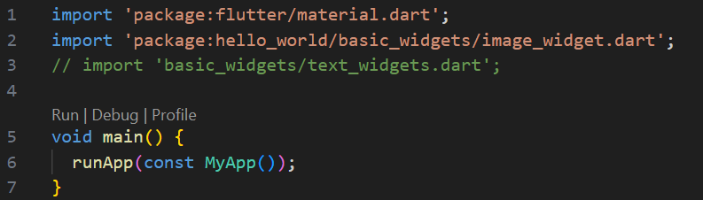
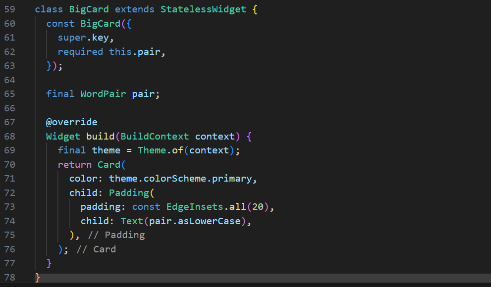
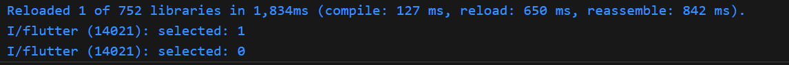

# Pemrograman Mobile - Pertemuan #5

NIM : 2141720064

Nama : Raden Rizki

#

<h3>Praktikum 1: Praktikum 1: Membuat Project Flutter Baru</h3>

#

<h4>Langkah 1: Buat Project Aplikasi Flutter Baru</h4>

<h4>Langkah 2: Pilih Lokasi</h4>

<h4>Langkah 3: Beri Nama Project</h4>

<h4>Langkah 4</h4>

#

<h3>Praktikum 2: Membuat Repository GitHub dan Laporan Praktikum</h3>

#

<h4>Langkah 11: Run Debugging</h4>

- Dari Error diatas, saya coba untuk running menggunakan web Chrome

#

<h3>Praktikum 3: Menerapkan Widget Dasar</h3>

#

<h4>Langkah 1: Text Widget</h4>

- Import text_widgets.dart di main.dart

- Output

<h4>Langkah 2: Image Widget</h4>

- Import image_widget.dart di main.dart

- Output

- Menyesuikan ukuran image pada image_widget.dart

- Output

#

<h3>Praktikum 4: Menerapkan Widget Material Design dan iOS Cupertino</h3>

#

<h4>Langkah 1: Cupertino Button dan Loading Bar</h4>

- 

- Output

- Saya coba menjalankan class ButtonCupertinoWidget langsung dalam function main file main.dart

- Output

<h4>Langkah 2: Floating Action Button (FAB)</h4>

- Output

<h4>Langkah 3: Scaffold Widget</h4>

[Kode Program Scaffold Widget](src/hello_world/lib/basic_widgets/scafold_widget.dart)

- Output

<h4>Langkah 4: Dialog Widget</h4>

[Kode Program Scaffold Widget](src/hello_world/lib/basic_widgets/dialog_widget.dart)

- Output

<h4>Langkah 5: Input dan Selection Widget</h4>

- Output

<h4>Langkah 6: Date and Time Pickers</h4>

[Kode Program Date and Time Pickers](src/hello_world/lib/basic_widgets/date_time_pickers_widget.dart)

- Output

#

<h3>Tugas Praktikum: Codelabs: Your first Flutter app</h3>

#

<h4>A. Menambahkan tombol</h4>

#

<h4>1. Meluncurkan Aplikasi</h4>

- Output Browser

- Output Smartphone

<h4>2. Hot Reload Pertama</h4>

- Console

- Output Smartphone

<h4>3. Menambahkan Tombol</h4>

- Output Smartphone

#

<h4>B. Memperindah tampilan aplikasi</h4>

#

<h4>1. Mengekstrak widget</h4>

- Klik Refactor

- Pilih Extract Widget

- Beri nama widget

- Big Card Class

<h4>2. Menambahkan Kartu</h4>

- Big Card Class

- Output Smartphone

<h4>3. Tema dan gaya</h4>

- Big Card Class

- Output Smartphone

- Color Scheme

- Output Smartphone

<h4>4. TextTheme</h4>

- Big Card Class

- Output Smartphone

<h4>5. Meningkatkan aksesibilitas</h4>

- Big Card Class

[Output Semantic](docs/output_semantic.mp4)

<h4>6. Menempatkan UI di tengah</h4>

- Output Smartphone

- Output Smartphone

- Output Smartphone

#

<h4>C. Menambahkan Fungsi</h4>

#

<h4>1. Menambahkan logika bisnis</h4>

<h4>2. Menambahkan tombol</h4>

- Output smartphone

- Kode Program Icon

- Output smartphone

#

<h4>D. Menambahkan kolom samping navigasi</h4>

#

[Kode Program Generator Page](src/my_gothcha_namer/lib/kode_program_backup/main_generator_page.dart)

- Output smartphone

- Console

<h4>1. Widget stateless versus stateful</h4>

- Stateful widget MyHomePage

<h4>2. setState</h4>

- Output smartphone

<h4>3. Menggunakan selectedIndex</h4>

- Output smartphone

<h4>4. Tingkat Respons</h4>

- Output smartphone

#

<h4>E. Menambahkan Halaman Baru</h4>

#

- Merubah class pada case 1

- Output smartphone

#