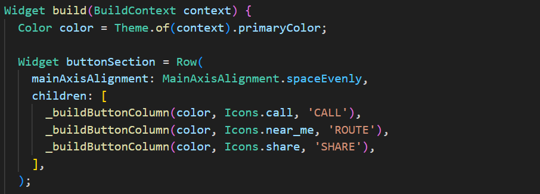
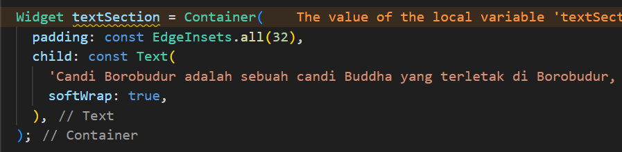
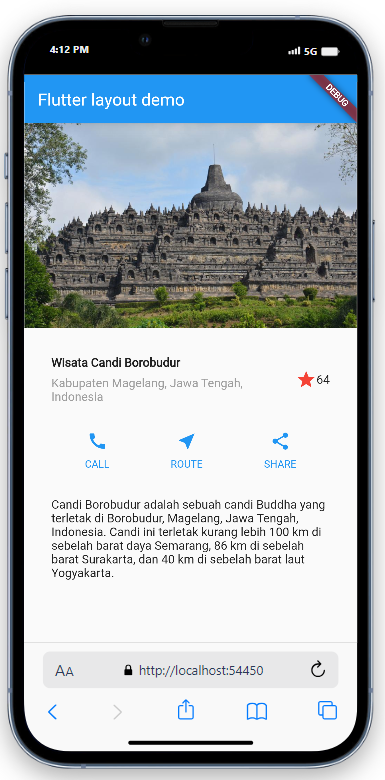
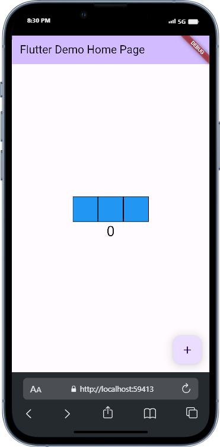
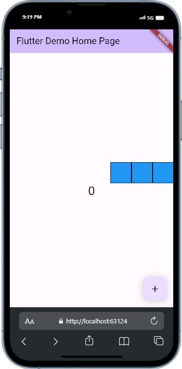

# Pemrograman Mobile - Pertemuan #7

NIM : 2141720064

Nama : Raden Rizki

#

<h3>Praktikum 1: Membangun Layout di Flutter</h3>

#

<h4>Langkah 1: Buat Project Baru</h4>

<h4>Langkah 2: Buka file lib/main.dart</h4>

<h4>Langkah 3: Identifikasi layout diagram</h4>

<h4>Langkah 4: Implementasi title row</h4>

[Kode Program Main Praktikum 1](src/layout_flutter/lib/backup_file/main_1.dart)

#

<h3>Praktikum 2: Implementasi button row</h3>

#

<h4>Langkah 1: Buat method Column _buildButtonColumn</h4>

<h4>Langkah 2: Buat widget buttonSection</h4>

<h4>Langkah 3: Tambah button section ke body</h4>

#

<h3>Praktikum 3: Implementasi text section</h3>

#

<h4>Langkah 1: Buat widget textSection</h4>

<h4>Langkah 2: Tambahkan variabel text section ke body</h4>

#

<h3>Praktikum 4: Implementasi image section</h3>

#

<h4>Langkah 1: Siapkan aset gambar</h4>

<h4>Langkah 2: Tambahkan gambar ke body</h4>

<h4>Langkah 3: Terakhir, ubah menjadi ListView</h4>

# 

<h3>Tugas Praktikum: Basic Layout Flutter</h3>

# 

#

<h4>Row and Column classes</h4>

#

[Kode Program Row Column Widget](src/basic_layout_flutter/lib/widget/row_column.dart)

| Penggunaan Row | Penggunaan Column |
|----------------|-------------------|
 |  | 

#

<h4>Axis size and alignment</h4>

#

mainAxisSize property

[Kode Program Axis Size Widget](src/basic_layout_flutter/lib/widget/axis_size.dart)

| Penggunaan max | Penggunaan min |
|----------------|-------------------|
 |  | 

mainAxisAlignment property

[Kode Program Axis Alignment Widget](src/basic_layout_flutter/lib/widget/axis_alignment.dart)

| Penggunaan start | Penggunaan end |
|----------------|-------------------|
 |  | 

crossAxisAlignment property

[Kode Program Cross Axis Alignment Widget](src/basic_layout_flutter/lib/widget/cross_axis_alignment.dart)

| Penggunaan center | Penggunaan start |
|----------------|-------------------|
 |  | 

#

<h4>Flexible widget</h4>

#

Changing fit properties

[Kode Program Fit Properties Widget](src/basic_layout_flutter/lib/widget/fit_properties.dart)

| Penggunaan loose | Penggunaan tight |
|----------------|-------------------|
 |  | 

Testing flex values

[Kode Program Flex Values](src/basic_layout_flutter/lib/widget/flex_values.dart)

| Penggunaan values 1 | Penggunaan values 2 |
|----------------|-------------------|
 |  | 

#

<h4>Expanded widget</h4>

#

Filling extra space

[Kode Program Extra Space](src/basic_layout_flutter/lib/widget/extra_space.dart)

| Penggunaan default | Penggunaan expanded |
|----------------|-------------------|
 |  | 

#

<h4>SizedBox widget</h4>

#

Resizing a widget

[Kode Program Resizing](src/basic_layout_flutter/lib/widget/resizing.dart)

| Penggunaan width | Penggunaan +height |
|----------------|-------------------|
 |  | 

Creating space

[Kode Program Space](src/basic_layout_flutter/lib/widget/space.dart)

| Penggunaan 50 | Penggunaan 25 |
|----------------|-------------------|
 |  | 

#

<h4>Spacer widget</h4>

#

Creating more space

[Kode Program More Space](src/basic_layout_flutter/lib/widget/more_space.dart)

| Penggunaan 1 flex | Penggunaan 2 flex |
|----------------|-------------------|
 |  | 

#

<h4>Text widget</h4>

#

Aligning text

[Kode Program Text Widget](src/basic_layout_flutter/lib/widget/text.dart)

| Penggunaan center | Penggunaan baseline |
|----------------|-------------------|
 |  | 

#

<h4>Icon widget</h4>

#

Creating an Icon

[Kode Program Icon Widget](src/basic_layout_flutter/lib/widget/icon.dart)

| Penggunaan icon | Penggunaan add icon |
|----------------|-------------------|
 |  |

#

<h4>Image widget</h4>

#

Displaying an image

[Kode Program Image Widget](src/basic_layout_flutter/lib/widget/image.dart)

| Penggunaan pic1.jpg | Penggunaan pic2.jpg |
|----------------|-------------------|
 |  |

#

<h4>Putting it all together</h4>

#

[Kode Program](src/basic_layout_flutter/lib/widget/personal.dart)

Part 1

Part 2

Part 3

#