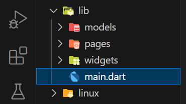
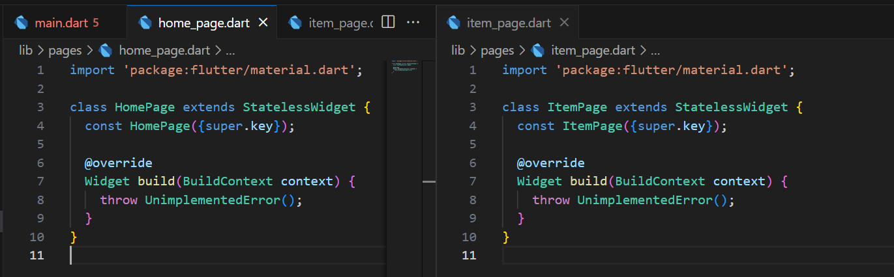
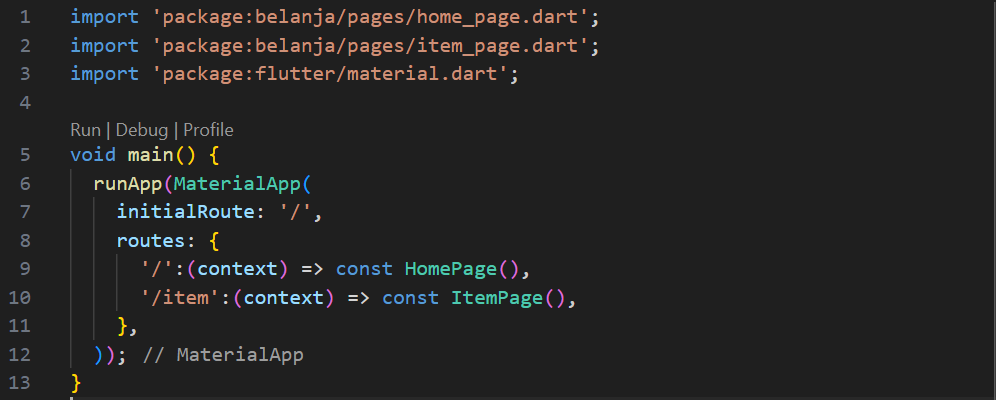
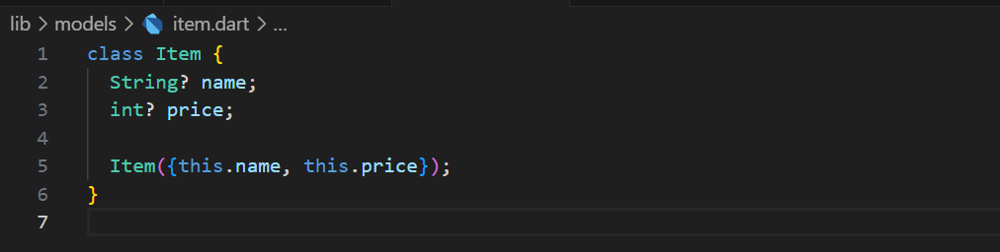
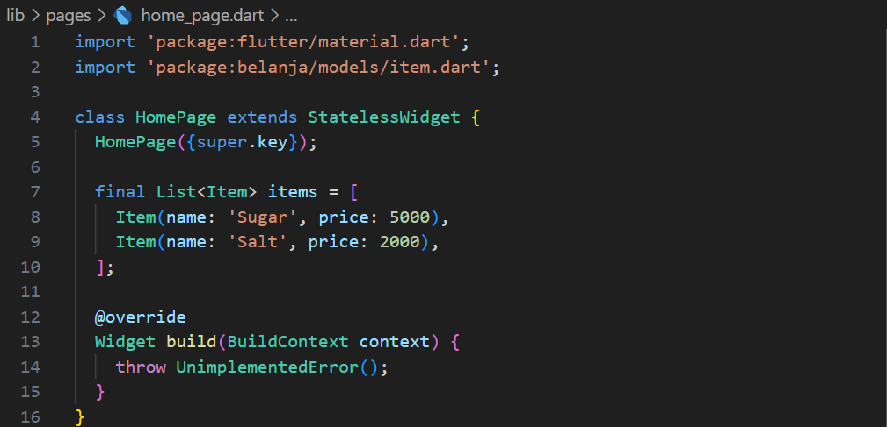
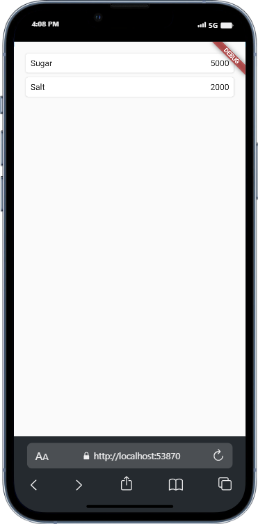
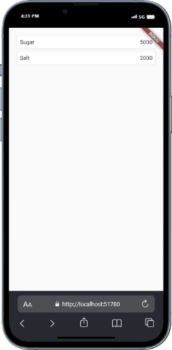
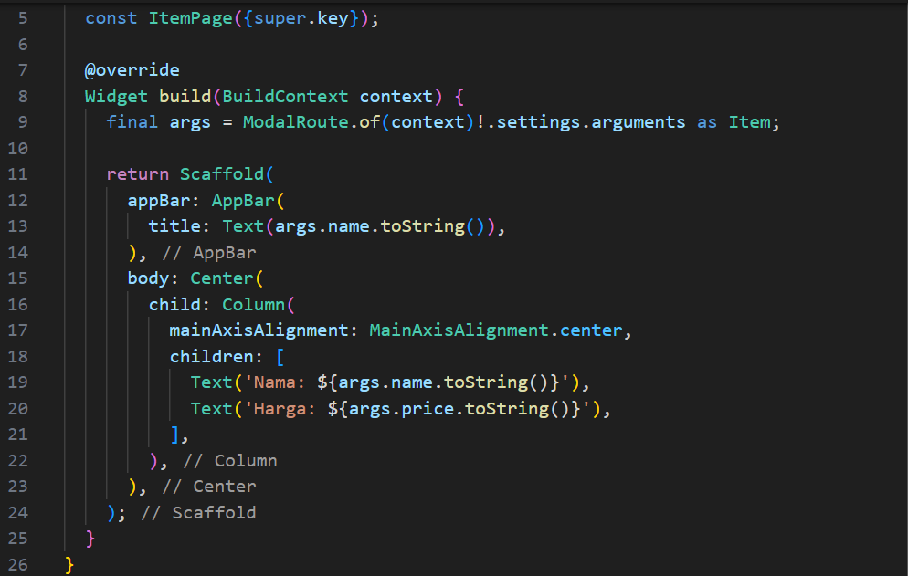
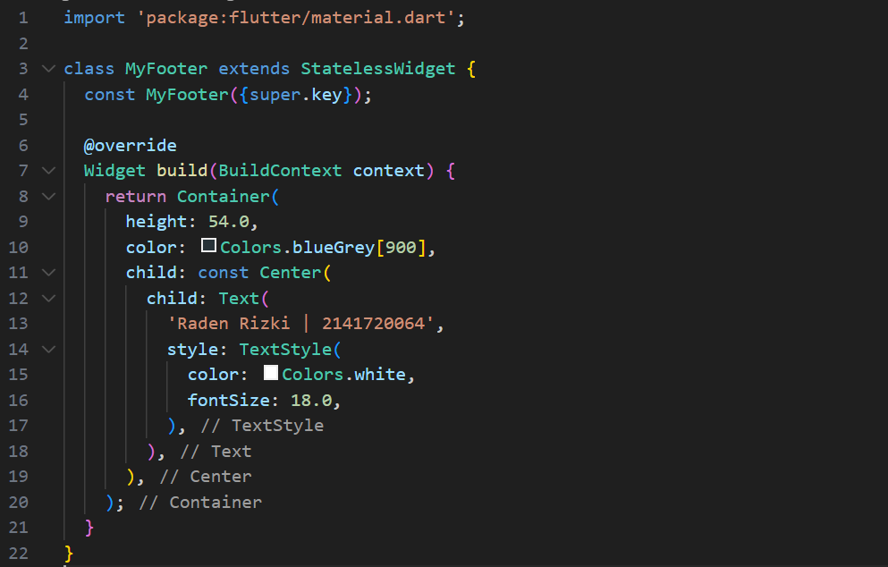
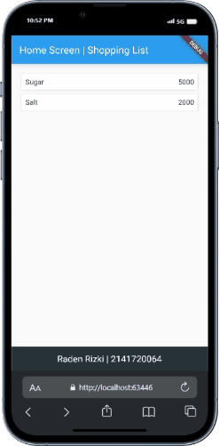

# Pemrograman Mobile - Pertemuan #8

NIM : 2141720064

Nama : Raden Rizki

#

<h3>Praktikum 1: Membangun Navigasi di Flutter</h3>

#

<h4>Langkah 1: Siapkan project baru</h4>

<h4>Langkah 2: Mendefinisikan Route</h4>

<h4>Langkah 3: Lengkapi Kode di main.dart</h4>

<h4>Langkah 4: Membuat data model</h4>

<h4>Langkah 5: Lengkapi kode di class HomePage</h4>

<h4>Langkah 6: Membuat ListView dan itemBuilder</h4>

[Kode Program home_page.dart](src/belanja/lib/backup/home_page.dart)

<h4>Langkah 7: Menambahkan aksi pada ListView</h4>

<h4>Langkah 8: Perbaikan dan Modifikasi</h4>

- Penambahan Title dan Kode pada ItemPage, serta Footer Nama dan NIM

- Output

<h4>Langkah 9: Animate a widget across screens</h4>

